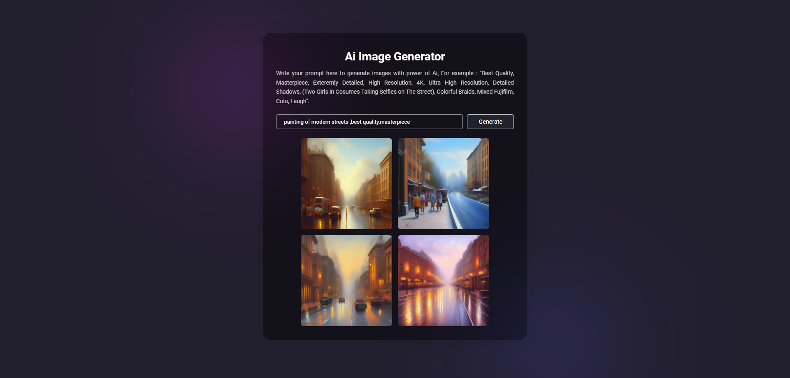

# OpenJourney Image Generator

## Overview

The OpenJourney Image Generator is a web application powered by a Generative AI model from Hugging Face's PromptHero. This application allows users to create unique and imaginative images using state-of-the-art generative models.

## Features

**Image Generation:** Generate diverse images by providing prompts to the underlying AI model.
**Interactive Interface:** User-friendly web interface for easy interaction.
**API Integration:** Utilizes the Hugging Face API for seamless integration and model inference.

## Preview

⚠️Use Your own API From the Hugging Facee OpenJourney Image Generator⚠️
